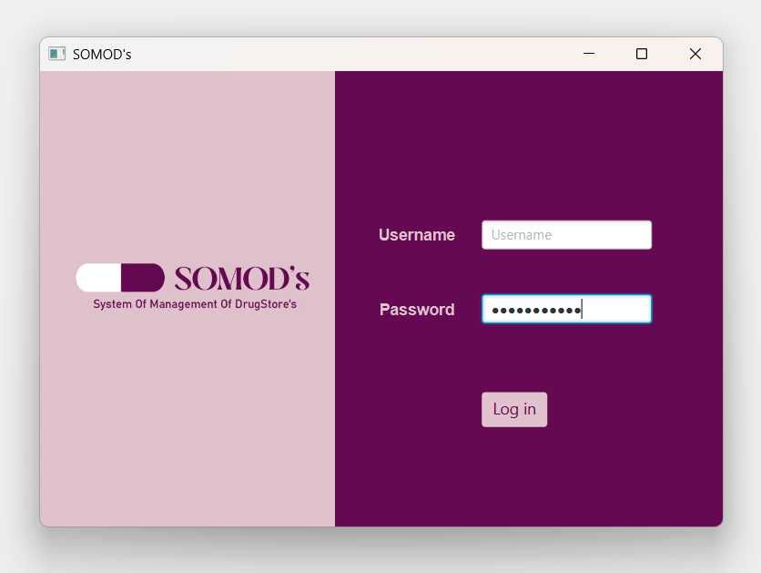

# 💊 SOMOD's – System Of Management Of DrugStore's

Sistema desktop de gerenciamento de farmácias, desenvolvido em Java com JavaFX.  
Permite controlar **clientes**, **funcionários**, **produtos** e realizar **vendas** com emissão de notas fiscais, com interface moderna e conexão com banco de dados PostgreSQL.

---

## 🖥️ Tela Inicial



---

## 🛠 Tecnologias Utilizadas

- Java 17+
- JavaFX + FXML
- Scene Builder
- PostgreSQL (via JDBC)
- Eclipse IDE

---

## ⚙️ Funcionalidades

- Login de funcionários
- Cadastro e gerenciamento de clientes, funcionários e produtos
- Registro e controle de vendas
- Emissão de nota fiscal
- Interface amigável com JavaFX
- Banco de dados relacional com PostgreSQL

---

## 🚀 Como Executar o Projeto

1. **Clone o repositório:**

   ```bash
   git clone https://github.com/seu-usuario/SOMODs.git
